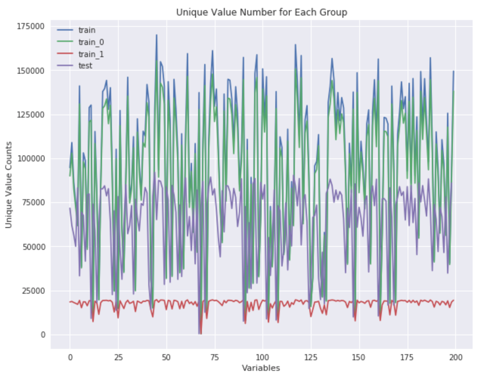
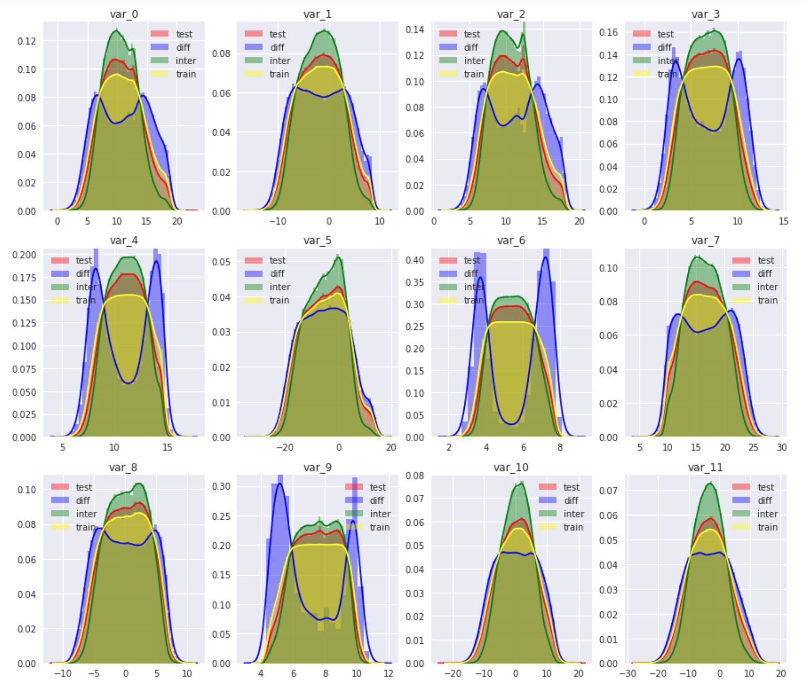

# Santander-Customer-Transaction-Prediction

**68th Solution** of Santander-Customer-Transaction-Prediction in Kaggle.

## Key points in this competition:
 - **Real & Sythetic Data**: Quite big part of the data are sythetic, for both training data and test data. I guess the competition host did this way to avoid data leakage and leaderboard probing. But they used different ways to generate synthetic data:
 
    - Test data: Half of the instances are synthetic, whose variables are sampled from those real data.
    - Training data: Each instance are real, but for each instance about half of the features are added noise.
 
 - **Feature Independence**: The 200 anolymized features are nearly zero correlated, the host use some decomposition method to make all features uncorrelated, tiny correlation are from noises. That is why naive bayes model has a really good performance on the data. One idea I got from a paper but didn't have time to try is use a naive bayes model to be a noise detector, that mark those instances naive bayes model failed to correctly predict as a noise point.
 
 
 - **Data Noise**: Based on the finding that variables in training data are added noises, I checked more closely on the noise distribution for those label=0 and label=1 cases. Found that for those label=1, fewer variables are added noises, the host might did this way to void those minority cases be dominated by the noise. And this could explain why mark those noise point could help to better classify label=0 and label=1 cases.

## How to find noises by EDA
 - Firstly I checked the unique value numbers for each variable, in different subgroups, and noticed there is a significant difference for the number of unique values between training data and test data, given they have the same size (200k):
 
  - Training Data
  - Test Data
  - Training Data with label=0
  - Training Data with label=1

 - Then based on this observation, I further check the distribution of each variable, for each subgroup:
 
  - Test data
  - Training data
  - Training data that variable values appear in test data
  - Training data that variable values do not appear in test data
 
 In this picture we can easily tell the difference exist on the distribution of those subgroups of data. The overlapping data are more centered while those data appear in training data but not in test data are more dispersed. Which all support the assumption that those data are added noise based on original data.
 
 For for EDA to get insights from the data, you can check my EDA notebook.
 
## Key Strategies
- **Deliver information to the model about noises**: Since we already know the existence of noise in training data, the first strategy is to deliver this information to the model. I added another 200 features to mark if the instance-variable level point are noised or not, if they are seemed to be noise, I mark those points to be `nan`, and if they are not noise, I retain the raw values.

- **Use different ways to Denoise data**: Since there is noise in training data, but not in the test data, which makes the distributions between training data and test data are quite different. Finding a way to denoise the training data is the key to improve the model performance and make the result consistent in test data. Here are some strategies I tried to denoise the data:

 1. **Round the raw data:** The model would learn the rank relations within each variable for each instance, the noise would possibly reorder the original relation. By roughly round the raw data, data ordinal relations would be more robust to tiny noises. Another benefit for the round operation is it could automatically fit the scale of different features. 
 
 2. **Clustering:** Roughly round could have some problems to optimize data clustering, since it is only based on the specific digit points. A better way to cluster the data is clustering data based on a more reasonalbly way. So I also used some clustering algorithms to smarterly cluster the data. i.e., clustering based on distrance: K-means; clustering based on distribution density: DbScan
 3. **Smoothing:** Smoothing is another way to denoise data, in this case I tried the Savitzky-Golay filter in Scipy package to smooth the data.

## Model & Features
The model I used in this competition is quite simple, which is a LightGBM model, I tried blending XGBoost with LightGBM but it doesn't have a significant improvement.
There are totally 602 features are included for modeling:

-  The original 200 features.
-  200 features with mark noise data as `nan`.
-  200 feature mark if the feature are in the 2.5-97.5 percentile of the whole dataset, within that feature.
-  2 statistics features got across different features, after standardizing all features.

## Things I learned from this competition:

* Better understand what Machine Learning cannot learn. (High Level Aggregation: Count; Noise in the data)
* Better understand different ways to denoise data.
* Better understand the hyper-parameter in Tree based Gradient Boosting Models.
* Better understand the usage of different clustering and smoothing algorithms, and learned the way combine unsupervised learning with supervised learning.
* It is always important to make EDA based on the variable distribution and make comparison between training data and test data.

## Things could have done better.

* Adding more high level aggregation features, which model "cannot see" into the model. Like count encoding.
* Deeper EDA could be done and more statistics features could be used.
* Learned from top winner solutions, neural network probably not good for tabular data, but could be used in a creative way to best extract the information. (e.g., Using CNN to parse different level information)